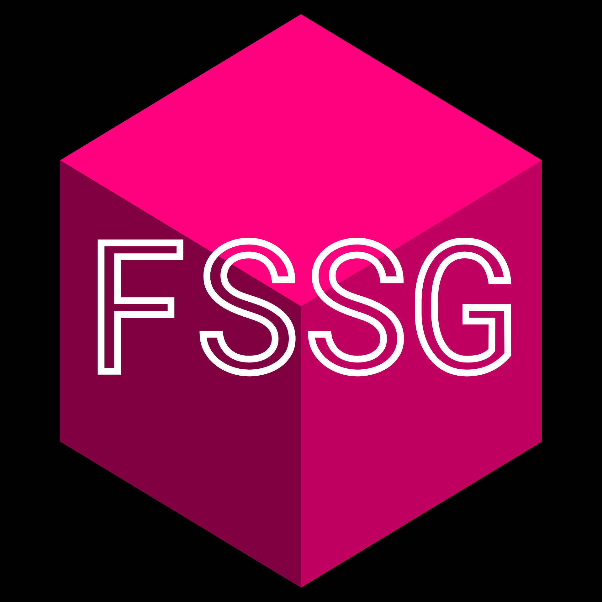

<!---->
# The Free (& open-source) School Software Group

### For students & teachers, by students, with school communities in mind.

Monetary gain isn't why we make things. **So why do we?** For the benefit of others. We aim to fix these issues without demanding a dime:

- It's upsetting whenever schools outsource program needs to poor party choices.
  - Google doesn't deserve the trust it has from the general population in the slightest.
    - (see [tax evasion](https://en.wikipedia.org/wiki/Google#Tax_avoidance_strategies), [terrible privacy, monopolistic behavior,](https://en.wikipedia.org/wiki/Google#Criticism_and_controversies) and [preventing union organization/construction](https://en.wikipedia.org/wiki/Alphabet_Inc.#cite_ref-61). there's still more.)
  - Other programs may be trustworthy, but are **severely unfriendly for the user.**
  - Providing alternatives can **take power away from those who abuse it.**
- Many people don't know their schedule, homework, grades, or have **access to necessary resources.**
  - This is mostly in part to having splintered systems.
    - The school the FSSG was formed at \[had/has\] 3 different primary resources, with many more secondary ones.
  - With one/few consolidated & integrated systems, the effort required to participate in school is significantly reduced.
- Reverse laziness?
  - If schools won't teach us how to make websites, we'll teach ourselves.
- Credit (attribution).
  - Let's be honest here, being attributed for your work is pretty cool.
